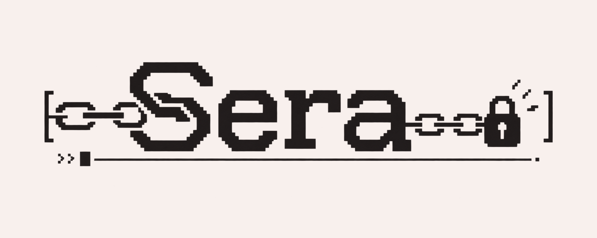
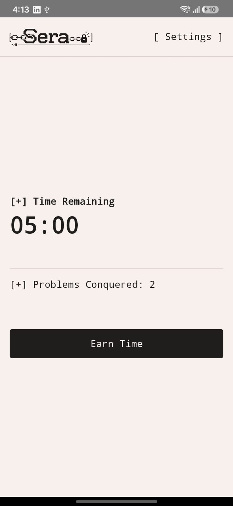
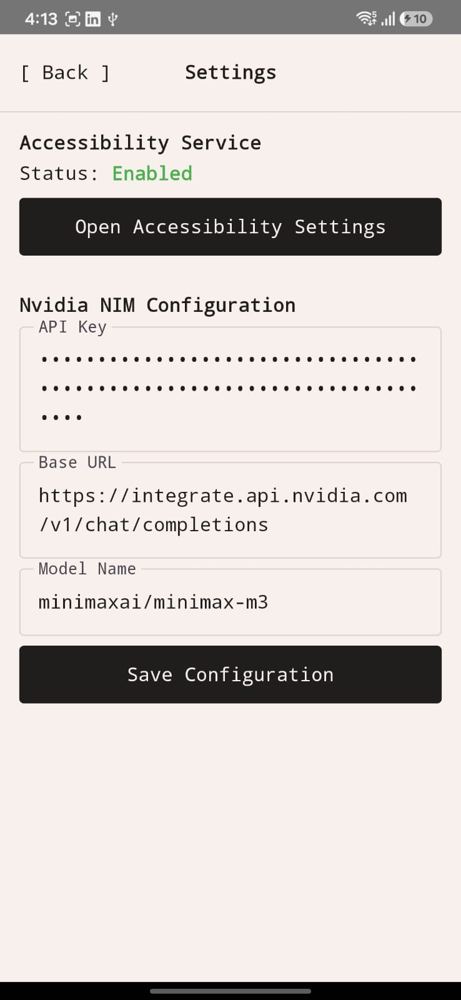
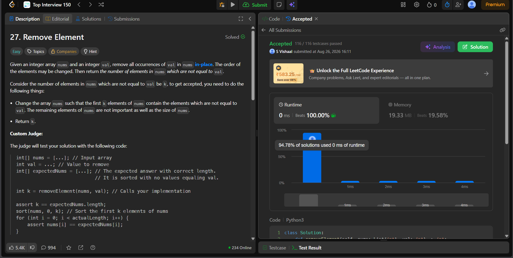

<div align="center">
  
  <h1>Sera</h1>
  <p><strong>A ruthless Android productivity app that holds Instagram hostage until you solve LeetCode problems.</strong></p>
</div>

<br/>

Sera is a local-first Android application designed to cure doom-scrolling by enforcing a strict "Proof of Work" protocol. You cannot open Instagram until you solve a LeetCode problem and explain your solution to a strict AI interviewer.

## 📸 Screenshots
<div align="center">
  
  &nbsp;&nbsp;&nbsp;&nbsp;
  
</div>

## 🚀 Usage Instructions

1. **The Lock:** An Accessibility Service runs silently in the background, monitoring your foreground apps. If you launch Instagram with 0 "Credit Time," Sera instantly intercepts the screen with an impenetrable overlay.
2. **The Key:** To earn time, you must solve a LeetCode problem. Point your phone at your computer screen and take a photo of the accepted solution.
   - **Important:** Ensure your screen shows the problem description on the left and the "Accepted" tab on the right, exactly like this:
   <br/>
   <div align="center">
     
   </div>
3. **The Validation:**
   - **Local OCR:** Sera uses on-device Google ML Kit to parse your screen, using spatial heuristics to verify the problem ID and ensure it shows "Accepted."
   - **AI Interviewer:** You must type an explanation of your algorithm (logic, time complexity, and space complexity). Sera securely sends this to an LLM (default: Nvidia NIM Llama-3.1-8B).
   - **The Reward:** If the AI validates your logic, you earn **5 minutes of Instagram time**.

## 🛠 Architecture

- **100% Kotlin & Jetpack Compose:** Built with modern Android UI paradigms.
- **Local Persistence (DataStore):** Stores user settings, credit time, and completed problem IDs (to prevent cheating by submitting the same problem twice).
- **CameraX & ML Kit:** Fast, on-device OCR. No photos are ever uploaded to the cloud.
- **OkHttp & Gson:** For lightweight, fast API calls to any OpenAI-compatible LLM endpoint.
- **OpenCode TUI Aesthetic:** A beautiful, minimal, terminal-inspired user interface.

## 💻 Local Development & Setup

This repository is built to be credential-free. You must provide your own LLM API key.

1. Clone the repository.
2. Create a `local.properties` file in the root directory.
3. Add your OpenAI-compatible API key (default setup uses Nvidia NIM):
   ```properties
   NIM_API_KEY=nvapi-YOUR-API-KEY-HERE
   NIM_BASE_URL=https://integrate.api.nvidia.com/v1
   NIM_MODEL=meta/llama-3.1-8b-instruct
   ```
4. Build and install via Android Studio.

## 🔑 How to get a free API Key
Sera is configured by default to use Nvidia NIM, which provides generous free credits:
1. Go to [build.nvidia.com](https://build.nvidia.com).
2. Create an account and navigate to the **Llama 3.1 8B Instruct** model.
3. Click "Get API Key" and paste it into your `local.properties` (or input it directly via the app's Settings screen).

## 📄 License
MIT License
